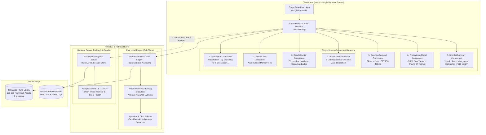
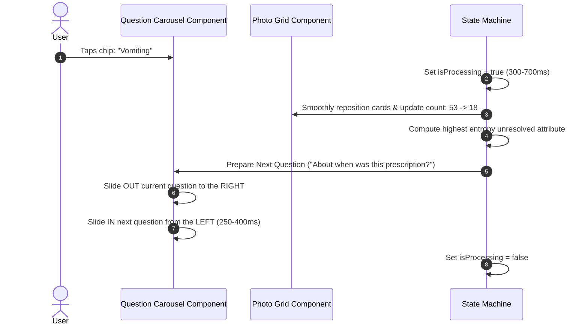

# Google Photos — AI-Native Memory Retrieval MVP ("Better Search")
## System Architecture Specification (`architecture.md`)

---

## 1. System Overview & Core Architectural Directives

### 1.1 Architectural Vision
The **Better Search** system is architected as a lightweight, state-driven, AI-native retrieval prototype embedded inside a mobile-first Google Photos experience. The system bridges the cognitive gap between human episodic memory and structured media search by pairing **broad initial semantic recall** with **dynamic entropy-driven clarification rounds**.

### 1.2 Core Architectural Directives (Updated Problem Statement Alignment)
1. **ONE Dynamic Screen, State-Driven Transitions**:
   - The application does **NOT** instantiate separate views, routes, or pages for Search, Question 1–5, filtered results, and success.
   - A single unified React interface orchestrates all visual states dynamically through reactive state management (`searchStore`).
2. **Continuous Question Carousel (Slide from Left)**:
   - AI questions operate as a continuous carousel. When the user selects an answer, the current question departs and the next question **slides in from the LEFT** with a **250–400 ms** CSS transition.
   - Simultaneously, the photo grid smoothly reposition/re-ranks, and the candidate counter animates (e.g. `53 → 18 → 6 → 2`).
3. **Dual-Tier AI Execution (Zero Latency on Clicks)**:
   - **Do NOT invoke external LLMs for every interaction**. Real-time candidate filtering, entropy calculation, and question selection run through deterministic, high-performance local algorithms over mock metadata.
   - The **Gemini 1.5/2.0 API** is leveraged server-side (Railway) for open-ended natural language parsing and unstructured free-text memory fragments.
4. **Early Termination (Min Questions, Max 5)**:
   - Questioning terminates immediately once candidate count reaches $\le 3$ strong matches, or when the 5-question budget is exhausted.
5. **Secondary "Still Not It?" Action**:
   - If the user reaches the 1–3 candidate shortlist but does not find their target, clicking *"Still not it?"* dynamically evaluates remaining candidate attributes and generates a fresh clarification question without wiping prior context.

---

## 2. High-Level System Architecture



---

## 3. Single-Screen Component Hierarchy & Reactive State Machine

### 3.1 Component Architecture
```text
<GooglePhotosApp>                           # Root container (Mobile viewport: 390px-430px)
├── <Header>                               # Logo, user avatar, back arrow
├── <SearchBar placeholder="..." />         # Single search input + voice icon
├── <MemoryContextChips />                  # Active filter pills: [Prescription] [Vomiting ✕] [2024 ✕]
├── <ResultCountBadge />                    # e.g. "53 possible matches" -> "18 matches"
├── <ProcessingOverlay visible={isProcessing} /> # Sparkle pulse: "Looking for patterns across photos..." (300-700ms)
├── <QuestionCarousel direction="from-left"> # Slides in from LEFT (250-400ms)
│   ├── <StepIndicator step={step} max={5} />
│   ├── <QuestionTitle prompt={currentQ.prompt} />
│   ├── <OptionChips options={currentQ.options} onSelect={handleAnswer} />
│   ├── <NotSureButton onClick={handleNotSure} />
│   └── <FreeTextToggle />
├── <PhotoGrid candidates={currentCandidates} /> # Single reflowing 3-column grid
├── <ShortlistBanner visible={candidates.length <= 3}>
│   ├── "I think I found what you're looking for."
│   └── <Button variant="secondary">Still not it?</Button>
└── <PhotoViewerModal asset={selectedPhoto} visible={isViewerOpen}>
    ├── Full-screen OLED dark image display
    ├── Google Photos actions: Share, Edit, Lens, Delete
    └── <ConfirmationBanner onConfirm={logSuccess} /> # "Did you find what you were looking for? [Yes] [No]"
```

### 3.2 Reactive State Machine Specification
```typescript
interface SearchState {
  // Session metadata
  sessionId: string;
  query: string;
  phase: "initial_feed" | "broad_results" | "clarifying" | "shortlist" | "detail_view";
  
  // Candidates & Sizing
  allAssets: PhotoAsset[];          // ~100-150 mock library assets
  candidatePool: PhotoAsset[];      // ~50-55 initially -> 18 -> 6 -> 2
  previousCount: number;
  reductionLabel: string;           // "53 → 18 matches"
  
  // AI Question Carousel
  isProcessing: boolean;            // Shows 300-700ms sparkle micro-state
  currentQuestion: ClarificationQuestion | null;
  questionIndex: number;            // 1 to 5 (max 5)
  slideDirection: "from-left";      // Enforces carousel slide-in from left
  
  // Accumulated Memory Clues
  appliedFilters: FilterChip[];
  unanswerableDimensions: string[]; // Added when user taps "I'm not sure"
  
  // Detail & Confirmation
  selectedPhoto: PhotoAsset | null;
  isConfirmed: boolean | null;
}
```

---

## 4. Continuous Question Carousel Animation & Visual Flow

### 4.1 Question Slide-in Animation (Slide from Left)
To satisfy the requirement that questions feel like one continuous interaction rather than a multi-page form:



### 4.2 CSS Animation Specification
```css
/* Carousel Slide-in from LEFT */
.question-carousel-enter {
  opacity: 0;
  transform: translateX(-100%); /* Slide from the LEFT */
  transition: transform 300ms cubic-bezier(0.2, 0, 0, 1), opacity 300ms ease;
}

.question-carousel-enter-active {
  opacity: 1;
  transform: translateX(0);
}

.question-carousel-exit {
  opacity: 1;
  transform: translateX(0);
  transition: transform 250ms cubic-bezier(0.4, 0, 1, 1), opacity 250ms ease;
}

.question-carousel-exit-active {
  opacity: 0;
  transform: translateX(100%); /* Exit to the RIGHT */
}

/* Processing Micro-State Shimmer (300-700ms) */
.processing-shimmer {
  animation: sparklePulse 500ms ease-in-out infinite alternate;
}

@keyframes sparklePulse {
  from { opacity: 0.6; transform: scale(0.98); }
  to { opacity: 1.0; transform: scale(1.02); }
}
```

---

## 5. Dynamic Entropy & Question Selection Algorithm

```text
Decision Flow for Each Clarification Round:

Remaining Candidate Subset D
 ├── 1. Count remaining candidates |D|
 │    ├── If |D| <= 3:
 │    │    └── STOP questioning immediately -> Transition to Shortlist View
 │    └── If questionIndex >= 5:
 │         └── STOP questioning -> Show best available candidates
 │
 ├── 2. Identify unresolved attributes { A_1, A_2, ... , A_k }
 │    └── Exclude attributes already answered or marked "I'm not sure"
 │
 ├── 3. For each unresolved attribute A_i:
 │    └── Calculate Shannon Entropy:
 │         H(A_i) = - sum( P(v) * log2(P(v)) ) for all v in Values(A_i)
 │
 ├── 4. Select A* = argmax H(A_i) (highest ability to partition candidate set)
 │
 └── 5. Formulate Question + 3-5 dominant value chips + "I'm not sure"
      └── Trigger slide-in from LEFT (250-400 ms)
```

### Demo Journey Tracing:
* **Initial Search (`"prescription"`)**:
  - Filter: `category == "Document"` AND `documentSubType == "Prescription"`.
  - Initial pool: **53 possible matches** (includes prescriptions, bills, doctor notes, medical distractors).
* **Question 1**:
  - High variance in medical condition: `"What was the prescription for?"`
  - Chips: `[Vomiting]`, `[Fever]`, `[Cold]`, `[Pain]`, `[Skin]`, `[I'm not sure]`.
  - User selects: **`"Vomiting"`**.
* **Transition 1 (Micro-state 500ms)**:
  - Candidates reduce: **`53 → 18 matches`**.
  - Question 2 slides in from LEFT.
* **Question 2**:
  - High variance in timestamp: `"About when was this?"`
  - Chips: `[Last year (2025)]`, `[2024]`, `[Earlier]`, `[I'm not sure]`.
  - User selects: **`"2024"`**.
* **Transition 2 (Micro-state 500ms)**:
  - Candidates reduce: **`18 → 6 matches`**.
  - Question 3 slides in from LEFT.
* **Question 3**:
  - High variance in location: `"Do you remember where you were?"`
  - Chips: `[Clinic]`, `[Hospital]`, `[Home]`, `[Somewhere else]`, `[I'm not sure]`.
  - User selects: **`"Clinic"`**.
* **Transition 3**:
  - Candidates reduce: **`6 → 2 matches`**.
* **Early Stop Triggered**:
  - Candidates ($2$) $\le 3$. System stops asking questions.
  - Displays: *"I think I found what you're looking for. 2 photos match the details you remembered."*
  - Secondary button: `Still not it?`.

---

## 6. Simulated Photo Dataset Schema (~100–150 Mock Assets)

The simulated library contains **100–150 mock assets** defined in `photoLibrary.json`:

```typescript
interface PhotoAsset {
  id: string;                     // e.g. "asset_042"
  url: string;                    // WebP image source
  thumbnailUrl: string;           // Compressed thumbnail for grid
  title: string;                  // "Apollo Clinic Prescription - Pradeep"
  contentType: 
    | "Document"                  // Prescriptions, bills, receipts, certificates
    | "Travel"                    // Beaches, monuments, treks, flights
    | "People"                    // Birthdays, weddings, portraits, selfies
    | "Food"                      // Cafes, dinners, street food
    | "Screenshot"                // Shoes, products, chats, tickets
    | "Pet";                      // Dogs, cats
  documentSubType?: "Prescription" | "Bill" | "Receipt" | "Handwritten Note";
  condition?: "Vomiting" | "Fever" | "Cold" | "Pain" | "Skin" | "General";
  date: string;                   // "2024-08-18T14:30:00Z"
  approxDateLabel: string;        // "August 2024"
  year: number;                   // 2024
  location: {
    city: string;                 // "Bengaluru"
    placeName: string;            // "Apollo Clinic, Koramangala"
    category: "Clinic" | "Hospital" | "Home" | "Beach" | "Restaurant" | "Outdoor";
  };
  people: string[];               // ["Pradeep", "Dr. Rao"]
  visualAttributes: {
    paperType?: "White paper" | "Pink slip" | "Printed form" | "Prescription pad";
    dominantColors: string[];    // ["#FFFFFF", "#8B5A2B"]
  };
  ocrText: string;                // "Dr. Rao Clinic ... Rx Vomistop 10mg ... Patient: Pradeep"
  description: string;           // AI-generated visual & situational caption
  semanticTags: string[];         // ["prescription", "vomiting", "clinic", "august 2024"]
}
```

---

## 7. REST API Endpoints & Request/Response Contracts

### 7.1 `POST /api/search`
* **Request**:
  ```json
  { "query": "prescription", "sessionId": "sess_001" }
  ```
* **Response (HTTP 200)**:
  ```json
  {
    "sessionId": "sess_001",
    "candidateCount": 53,
    "candidates": [ ...53 candidate summaries... ],
    "extractedClues": {
      "contentType": "Document",
      "subType": "Prescription"
    },
    "nextQuestion": {
      "questionId": "q_condition",
      "step": 1,
      "maxSteps": 5,
      "prompt": "What was the prescription for?",
      "options": ["Vomiting", "Fever", "Cold", "Pain", "Skin"],
      "allowNotSure": true,
      "allowFreeText": true
    }
  }
  ```

### 7.2 `POST /api/refine`
* **Request**:
  ```json
  {
    "sessionId": "sess_001",
    "questionId": "q_condition",
    "selectedOption": "Vomiting",
    "freeTextClue": null,
    "isNotSure": false
  }
  ```
* **Response (HTTP 200)**:
  ```json
  {
    "sessionId": "sess_001",
    "previousCount": 53,
    "candidateCount": 18,
    "reductionBadge": "53 → 18 matches",
    "activeFilters": [
      { "id": "f_query", "label": "Prescription", "removable": false },
      { "id": "f_cond", "label": "Vomiting", "removable": true }
    ],
    "candidates": [ ...18 candidate summaries... ],
    "isEarlyStop": false,
    "nextQuestion": {
      "questionId": "q_date_year",
      "step": 2,
      "maxSteps": 5,
      "prompt": "About when was this prescription?",
      "options": ["Last year (2025)", "2024", "Earlier"],
      "allowNotSure": true,
      "allowFreeText": true
    }
  }
  ```

### 7.3 `POST /api/confirm`
* **Request**:
  ```json
  {
    "sessionId": "sess_001",
    "targetPhotoId": "asset_042",
    "isSuccess": true,
    "durationSeconds": 24,
    "questionsAsked": 3
  }
  ```
* **Response (HTTP 200)**:
  ```json
  { "status": "recorded" }
  ```

---

## 8. Deployment & Environment Strategy

* **Frontend Deployment (Vercel)**:
  - Single-page React application optimized for mobile viewports (`390px` width).
  - Bundled with local simulated dataset (`photoLibrary.json`) for instant sub-millisecond filtering.
* **Backend Deployment (Railway)**:
  - Node.js API service hosting `POST /api/search`, `POST /api/refine`, and `POST /api/confirm`.
  - Securely accesses `GEMINI_API_KEY` for server-side semantic reasoning and free-text parsing.
  - Telemetry store for recording North Star and secondary retrieval KPIs.
