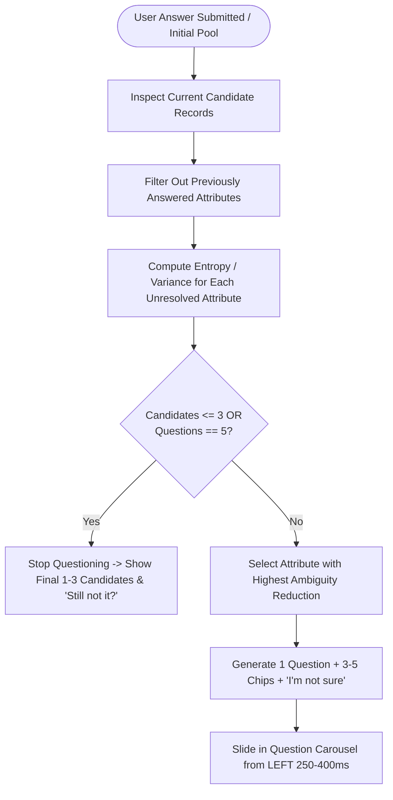

# Google Photos — AI-Native Memory Retrieval MVP ("Better Search")
## Product Context & Technical Specification (`context.md`)

---

## 1. Executive Summary & Product Vision

### 1.1 Product Vision
**Google Photos — Better Search** is an AI-native retrieval prototype designed to bridge the cognitive gap between human episodic memory and machine search. When users search for an old photo, they rarely recall exact file metadata or strict keywords; instead, they remember **vague, sensory, situational, or contextual fragments** (e.g., *"a photo from a trip sitting outside"*, *"a paper prescription for vomiting taken sometime last year in a clinic"*, or *"that screenshot of shoes I wanted to buy"*).

Traditional photo search engines either require exact keyword matches or return hundreds of unranked results, forcing users into frustrating query reformulations or exhaustive manual scrolling. 

**Better Search** fundamentally changes this paradigm through:
1. **ONE Dynamic Screen, State-Driven Architecture**: Avoids unnecessary UI sprawl. A single reusable screen dynamically shifts states (search bar, candidate count, photo grid, question carousel, filter chips, and viewer modal).
2. **Prioritizing Recall over Precision Initially**: Generates a broad candidate pool (~50–55 photos) containing strong matches, partial matches, contextual relatives, and realistic distractors.
3. **Dynamic Entropy-Driven Clarification**: Rather than static faceted filters or a fixed question order, the AI dynamically selects the missing clue with the highest expected ability to reduce ambiguity based on current candidate variance.
4. **Continuous Question Carousel (Slide from Left)**: Follow-up questions slide in smoothly from the **LEFT** (250–400 ms) as a fluid carousel interaction while the photo grid repositions and result count updates simultaneously.
5. **Minimum Questions, Maximum Five**: Asks only what is necessary to isolate 1–3 strong candidates, stopping as soon as confidence is sufficient.
6. **Graceful Uncertainty Handling**: Never forces users to invent details; provides an explicit *"I'm not sure"* option and free-form natural language refinement.
7. **Secondary "Still Not It?" Action**: If the final shortlist isn't what the user wanted, a single tap resumes questioning without resetting prior search context.

---

## 2. Core Experience & UX Principles

### 2.1 The "One Dynamic Screen" Imperative
The prototype must **not** generate separate routes or static pages for Search, Question 1, Question 2, Question 3, Question 4, Question 5, filtered results, and success. Instead, the interface consists of **one continuous screen** with reusable components whose visual presentation is governed by state:
* **One search bar** with default demo placeholder: *"Try searching for a prescription…"*.
* **One photo grid component** that smoothly reflows and re-ranks photos.
* **One AI question carousel component** where new questions slide in from the **left** (250–400 ms).
* **One memory / context chip component** accumulating user answers as dismissible pills.
* **One live result count** (e.g., `53 → 18 → 6 → 2`).
* **One photo viewer / detail modal** with retrieval confirmation (`"Did you find what you were looking for?"`).

### 2.2 Processing Micro-State
Between an answer click and the next question/grid update, the system displays a lightweight inline processing micro-state:
* **Visual indicator**: Subtle Gemini sparkle shimmer / pulse.
* **Text**: *"Looking for patterns across your photos…"*.
* **Duration**: **300–700 ms** (snappy micro-interaction; never a full-page blocker).

### 2.3 Lightweight AI Simulation Principle
To guarantee an instantaneous, fluid mobile demo without network lag:
* **Local Deterministic Logic**: Real-time candidate filtering, entropy calculation, and question selection are executed via high-performance local algorithms over mock candidate metadata.
* **Server-Side Gemini API**: Reserved for open-ended natural language parsing and free-text memory interpretation, storing `GEMINI_API_KEY` securely on the backend (Railway).

---

## 3. Detailed Screen-by-Screen UX Flow (Mapped to Figma 20-Screen Prototype)

The Figma prototype ([View Figma Prototype](https://www.figma.com/proto/x169sD73znDB9EOD2r42VB/Untitled?node-id=4-4812&p=f&t=7QuoOjEPTS5MMbxl-1&scaling=min-zoom&content-scaling=fixed&page-id=0%3A1)) defines the visual benchmark and interactive journey:

| Screen # | Frame Name | Core UI Components & Functional Specifications |
| :--- | :--- | :--- |
| **01** | `01 - Home Screen` | **Google Photos Feed**: Top search bar with placeholder *"Try searching for a prescription…"*, microphone icon, user profile avatar. Memories carousel header (*"A look back..."*), photo feed, bottom tabs (*Photos*, *Collections / Search*, *Sharing / Library*). |
| **02** | `02 - Initial Search (Unclear Intent)` | **Search Input State**: Mobile keyboard active with back arrow and clear button. User types broad memory: `"prescription"`. Recent searches & suggested chips below input. |
| **03** | `03 - Broad Search Results` | **Initial Retrieval Pool**: Header: `"Search results for 'prescription'"`. Counter badge: **`53 possible matches`** (broad candidate pool). Prominent **`Better Search ✨`** trigger chip. 3-column photo grid. |
| **04** | `04 - Better Search Nudge` | **Contextual Discovery Toast / Banner**: Bottom sheet/snackbar nudging user: *"Can't find what you're looking for? Try Better Search"* with action button: `[ ✨ Better Search ]`. |
| **05** | `05 - 1st Refinement Prompt` | **Bottom Sheet Clarification Carousel**: Header: `✨ Better Search`, dismiss `✕`, step indicator. Question: **"What was the prescription for?"** (or *"Do you remember who it was for?"*). Dynamic option chips: `[Vomiting]`, `[Fever]`, `[Cold]`, `[Pain]`, `[Skin]`. Fallback: `I'm not sure` button. Free-text link: *"Or write what you remember to refine your search"*. |
| **06** | `06a - AI Processing (Narrowing)` | **Active Processing Micro-State (300–700 ms)**: Gemini sparkle pulse. Text: *"Looking for patterns across your photos…"*. Active criteria chips: `[Prescription]`, `[Vomiting]`. Dynamic reduction badge: **`53 → 18 matches`**. |
| **07** | `07 - 1st Refinement Applied` | **Updated Grid View**: Next question **slides in from the left** (250–400 ms). Active chips displayed: `[Prescription]`, `[Vomiting ✕]`. Grid smoothly re-ranks and reflows to 18 candidates. |
| **08** | `08 - 2nd Refinement Prompt` | **Question 2 (Slid in from Left)**: Question: **"About when was this prescription?"** Multi-choice options: `[Last year (2025)]`, `[2024]`, `[Earlier]`, plus `I'm not sure`. |
| **09** | `09a - AI Processing (2nd Narrowing)` | **Second Processing Micro-State (300–700 ms)**: Active chips: `[Prescription]`, `[Vomiting]`, `[2024]`. Reduction metric: **`18 → 6 matches`**. |
| **10** | `10 - 2nd Refinement Applied` | **Updated Filtered Grid**: Photo grid narrows to 6 candidate photos. Banner: *"Showing results for your memory: Keep clarifying or browse below"*. |
| **11** | `11 - 3rd Refinement Prompt` | **Question 3 (Slid in from Left)**: Question: **"Do you remember where you were when you got it?"** Options: `[Clinic]`, `[Hospital]`, `[Home]`, `[Somewhere else]`, plus `I'm not sure`. |
| **12** | `12a - AI Processing (Final Narrowing)` | **Final Processing Micro-State**: Active pills: `[Prescription]`, `[Vomiting]`, `[2024]`, `[Clinic]`. Reduction counter: **`6 → 2 matches`**! |
| **13** | `13 - Final Result Set` | **Final Pinpoint State**: Questions stop early because candidates $\le 3$. Summary: *"I think I found what you're looking for. 2 photos match the details you remembered."* Secondary action: **`Still not it?`** button to generate another question. |
| **14** | `14 - Alternative Clue: Visual Appearance` | **Orthogonal Clue Branching**: If location/time is skipped via *"I'm not sure"*, AI pivots to visual traits: **"What did the document look like?"** Options: `[White paper]`, `[Printed form]`, `[Pink slip]`, `[Rx pad]`. |
| **15** | `15 - Visual Filter Applied` | **Processing Visual Clues**: Active chips: `[Prescription]`, `[White paper]`. Reduction indicator: **`18 → 3 matches`**. |
| **16** | `16 - 2 Results Left View` | **High-Confidence Shortlist**: Grid displaying 2 final candidate photos with direct tap to inspect. |
| **17** | `17 - Alternative 2-Results List View` | **Structured List Comparison Card**: Detailed metadata cards showing thumbnails, date (`Sept 2024`), condition, clinic name, and `View photo >` CTA. |
| **18** | `18 - Detail Photo View & Confirm` | **Immersive Photo Viewer & Retrieval Confirmation**: Full-screen OLED black background. Header: Back, Cast, Favorite, More (`⋮`). Footer: Date (`18 August 2024`), location, Google Photos actions (*Share*, *Edit*, *Lens*, *Delete*). **Confirmation Prompt**: *"Did you find what you were looking for? [Yes] [No]"* (Logs North Star Metric). |
| **19** | `19 - Free-Text Natural Language Refinement` | **Open-Ended Memory Input**: *"What else do you remember?"* Free-text field allowing natural language memory fragments (e.g. *"I think it was near the beach"* or *"Dr. Rao signed in blue ink"*). |
| **20** | `20 - 'I'm Not Sure' Flow Handling` | **Graceful Pivot State**: Feedback: *"I found some possibilities, but I need another clue."* AI immediately shifts to an orthogonal dimension without dead-ending. |

---

## 4. Product Objectives, Hypotheses & Metrics

### 4.1 Primary Hypothesis
> *If AI converts incomplete memories into useful contextual retrieval signals and progressively asks only the highest-value missing clue, users will find the intended photo with fewer searches and less manual browsing.*

### 4.2 Metrics Framework
* **North Star Metric**:
  * **Successful Vague-Memory Retrieval Rate (%)**: % of vague-memory searches that culminate in the user confirming they found the intended photo (`POST /confirm` = true).
* **Secondary KPIs**:
  * **Retrieval Success Rate**: Overall completion percentage across all retrieval sessions.
  * **Time to Retrieval (TTR)**: Seconds elapsed from initial search query to confirmation.
  * **Repeat Searches / Reformulations**: Number of query rewrites (target: $\le 1$ reformulation vs $\ge 3$ in traditional search).
  * **Recovery Rate within 3 Searches**: Percentage of users who find the photo within 3 clarification rounds.
  * **Average Results Viewed Before Retrieval**: Number of thumbnails inspected before target identification.
  * **% Users Switching to Manual Browsing**: Percentage abandoning AI guidance for unguided manual scrolling.
  * **Initial Candidate Pool Size**: Consistently ~50–55 photos.
  * **Number of AI Questions Asked**: Capped at 5 maximum; average target: 2–3 questions.
  * **Candidate Reduction After Each Answer**: Average % reduction per step (e.g., $53 \rightarrow 18 \rightarrow 6 \rightarrow 2$).

---

## 5. Simulated Dataset & Content-Agnostic Design

### 5.1 Dataset Specifications (~100–150 Mock Assets)
To balance broad initial recall (~50–55 items) with realistic disambiguation, the simulated library contains **100–150 rich visual assets** across multiple categories:
1. **Prescriptions & Medical**: Handwritten prescriptions, hospital bills, clinic receipts, medication boxes.
2. **Travel & Vacations**: Goa beach trip, Taj Mahal, mountain trek, airport selfies, outdoor cafés.
3. **People & Social Events**: Friend's birthday, family dinner, wedding celebrations, group gatherings.
4. **Food & Dining**: Café breakfast, restaurant pasta, Delhi street food, coffee cups, dinner menus.
5. **Screenshots & Digital Artifacts**: Shoe purchase screenshot, flight ticket booking, chat conversation, passport application document.
6. **Pets & Everyday Life**: Dog at the beach, cat on couch, office desk, rainy window, sunset over lake.
7. **Visually Similar Distractors**: Invoices, blank white documents, unrelated prescriptions, similar beach landscapes.

### 5.2 Content-Agnostic Query Support
While `"prescription"` serves as the primary demo journey, the data model and retrieval logic must effortlessly handle diverse queries:
* *"The small café we went to during my Goa trip."*
* *"The screenshot of the shoes I wanted to buy."*
* *"The receipt from the restaurant in Delhi."*
* *"The photo from my friend's birthday."*
* *"The document I saved for my passport application."*
* *"That photo of my dog at the beach."*

---

## 6. Dynamic Question Selection Algorithm

### Decision Rules:
1. **Dynamic Ordering**: Never enforce a hard-coded sequence (e.g. condition $\rightarrow$ date $\rightarrow$ location $\rightarrow$ appearance).
2. **Stopping Condition**: If remaining candidates $\le 3$, stop asking questions immediately and display the final shortlist.
3. **Carousel Interaction**: When an answer is chosen, the current question departs and the next question **slides in from the left** (250–400 ms) while the photo grid reflows.
4. **Secondary Action ("Still not it?")**: If the user reviews the shortlist and clicks *"Still not it?"*, the system evaluates the remaining candidates, formulates another question, and resumes questioning.

---

## 7. Technology Stack & API Contracts

* **Frontend**: **Vercel**. Single dynamic React-based interface with Material You styling, continuous question carousel, and instant local state filtering.
* **Backend**: **Railway**. Node.js / Python server hosting API endpoints, Gemini calls, and session analytics.
* **AI Engine**: Gemini 1.5 / 2.0 API (`GEMINI_API_KEY` stored securely server-side in Railway environment).
* **API Endpoints**:
  - `POST /search`: Ingests initial memory $\rightarrow$ returns ~50–55 candidates + Question 1.
  - `POST /refine`: Ingests user answer/text $\rightarrow$ returns filtered candidates + next question (or shortlist).
  - `POST /confirm`: Records whether target photo was found (tracks North Star metric).
  - `GET /session/:id`: Rehydrates session state.

---

## 8. Non-Goals
* **Do NOT build a generic AI chatbot**: The experience remains visual and photo-centric (Google Photos UI), not a chat bubble thread.
* **Do NOT limit to medical prescriptions**: Prescriptions are the demo journey; logic must remain content-agnostic.
* **Do NOT create separate static screens**: Must be ONE dynamic screen with state-driven component transitions.
* **Do NOT call an external LLM for every single interaction**: Use deterministic local simulation for fast interactive filtering, saving LLM calls for complex semantic parsing.
* **Do NOT require real Google Photos account authorization**: Uses simulated mock dataset (~100–150 assets).
