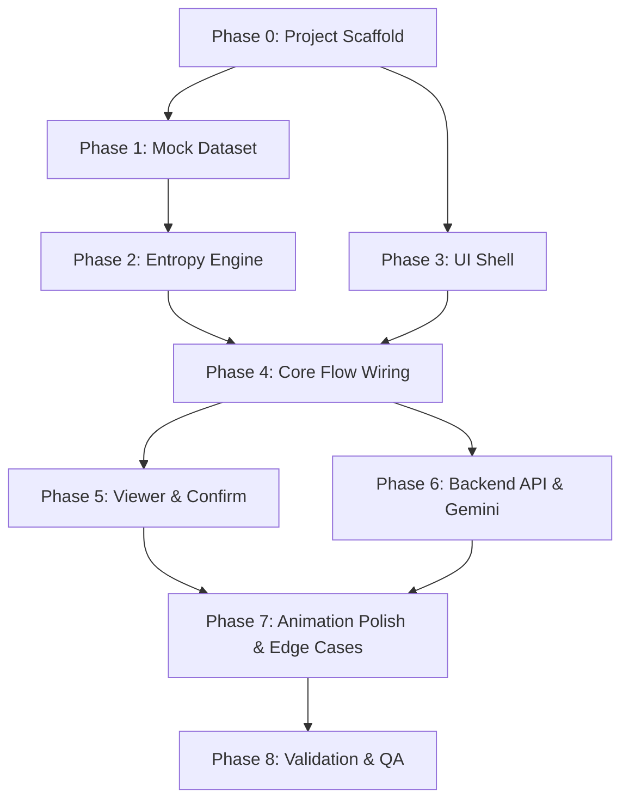

# Google Photos — AI-Native Memory Retrieval MVP ("Better Search")
## Implementation Plan (`implementationplan.md`)

---

## 1. Implementation Philosophy

### 1.1 Guiding Principles
1. **Build the skeleton first, polish last**: Get one end-to-end flow working (search → grid → question → narrowing → confirm) before perfecting animations, visual polish, or secondary paths.
2. **Data before UI**: The mock dataset and entropy engine must exist and function correctly before any frontend component is built, because every component depends on structured candidate data.
3. **ONE screen from Day 1**: Never create a multi-page architecture that would need to be refactored. Every phase builds on the same single-screen React component tree.
4. **Local-first, server-second**: Interactive filtering runs entirely client-side over bundled mock data. The Railway backend is introduced only when free-text parsing via Gemini and session telemetry are needed.

### 1.2 Milestone Summary

| Milestone | Phase | Deliverable | Estimated Effort |
| :--- | :--- | :--- | :--- |
| **M0** | Setup | Project scaffold, tooling, deployment pipelines | 0.5 day |
| **M1** | Data | Mock photo library (100–150 assets) + metadata JSON | 1–2 days |
| **M2** | Engine | Local entropy engine + deterministic question selector | 1 day |
| **M3** | UI Shell | Single-screen React skeleton (all 7 components wired to state) | 1–2 days |
| **M4** | Core Flow | End-to-end: Search → Broad pool → Question carousel → Narrowing → Shortlist | 2–3 days |
| **M5** | Viewer & Confirm | Photo detail modal + "Did you find it?" confirmation + telemetry logging | 1 day |
| **M6** | Backend API | Railway server: `/search`, `/refine`, `/confirm`, Gemini free-text parsing | 1–2 days |
| **M7** | Polish | Animations, micro-states, edge case handling, mobile responsiveness | 1–2 days |
| **M8** | Validation | End-to-end QA, evaluator walkthrough, metric verification | 0.5 day |

**Total estimated effort: 8–13 working days.**

---

## 2. Phase 0 — Project Scaffold & Tooling Setup

### 2.1 Objectives
- Initialize a Vite + React project in the workspace.
- Configure Vercel deployment for frontend.
- Configure Railway deployment for backend.
- Establish project directory structure matching [architecture.md §3](file:///d:/3.%20Career/Product%20Management/IDE/GP%20Better%20Search%20Prototype/architecture.md#L79).

### 2.2 Tasks

| # | Task | Detail | Output |
| :--- | :--- | :--- | :--- |
| 0.1 | **Initialize Vite + React** | `npx -y create-vite@latest ./ --template react` in `frontend/`. | Working `npm run dev` at `localhost:5173`. |
| 0.2 | **Initialize backend** | `npm init -y` in `backend/`. Install Express, cors, dotenv. | Working `node server.js` at `localhost:8080`. |
| 0.3 | **Configure Vercel** | Create `frontend/vercel.json` with `/api/*` rewrite to Railway backend URL. | API proxy active in production. |
| 0.4 | **Configure Railway** | Create `backend/Dockerfile` or `Procfile`. Add `GEMINI_API_KEY` to Railway env. | Backend deploys on push. |
| 0.5 | **Design tokens CSS** | Create `frontend/src/styles/main.css` with all CSS custom properties from [architecture.md §4.2](file:///d:/3.%20Career/Product%20Management/IDE/GP%20Better%20Search%20Prototype/architecture.md#L160): `--gp-primary`, `--gp-gemini-gradient`, radii, shadows, Google Fonts (Inter / Roboto). | Consistent visual language from first render. |
| 0.6 | **Mobile viewport meta** | Set `<meta name="viewport" content="width=device-width, initial-scale=1">` in `index.html`. Max-width container at `430px`. | Mobile-first from the start. |

### 2.3 Exit Criteria
- `npm run dev` renders a blank styled mobile shell at `390px` width.
- Backend responds to `GET /health` with `200 OK`.

---

## 3. Phase 1 — Mock Photo Library & Dataset

### 3.1 Objectives
- Author `photoLibrary.json` containing **100–150 structured mock assets** conforming to the [PhotoAsset schema](file:///d:/3.%20Career/Product%20Management/IDE/GP%20Better%20Search%20Prototype/architecture.md#L258).
- Collect or generate corresponding image assets (WebP thumbnails).

### 3.2 Tasks

| # | Task | Detail | Output |
| :--- | :--- | :--- | :--- |
| 1.1 | **Define category distribution** | Allocate assets across content types to ensure entropy-rich pools: • Prescriptions/Medical: ~25 assets • Travel: ~20 assets • People/Events: ~20 assets • Food: ~15 assets • Screenshots: ~15 assets • Pets/Everyday: ~10 assets • Distractors: ~15–20 assets | Category distribution spreadsheet. |
| 1.2 | **Author prescription sub-cluster** | Create ~25 prescription assets with deliberate variance across `condition` (Vomiting, Fever, Cold, Pain, Skin), `year` (2023, 2024, 2025), `location.category` (Clinic, Hospital, Home), `people`, and `visualAttributes.paperType`. This is the primary demo cluster. | 25 prescription records in JSON with high metadata variance. |
| 1.3 | **Author remaining categories** | Populate Travel, People, Food, Screenshot, Pet, and Distractor records with structured metadata, OCR text, and semantic tags. | Full 100–150 asset `photoLibrary.json`. |
| 1.4 | **Source or generate image assets** | For each asset, generate a placeholder image thumbnail (WebP, ~200×200px). Use `generate_image` tool or royalty-free placeholders. Store in `frontend/public/photos/`. | `/photos/asset_001.webp` through `/photos/asset_150.webp`. |
| 1.5 | **Validate dataset integrity** | Write a validation script that checks: every asset has all required fields, `contentType` is valid enum, `semanticTags` array is non-empty, no duplicate IDs, prescription sub-cluster has sufficient variance for 3+ entropy-driven questions. | Validation script passes with 0 errors. |

### 3.3 Critical Design Decision: Prescription Sub-Cluster Variance
To guarantee the demo flow `53 → 18 → 6 → 2`, the ~25 prescription assets must be distributed so that:
- Filtering by `condition: "Vomiting"` reduces to ~8–10 prescriptions.
- Further filtering by `year: 2024` reduces to ~4–5.
- Further filtering by `location.category: "Clinic"` reduces to ~2.
- The remaining ~28 initial candidates come from Document distractors (bills, receipts, handwritten notes with medical-adjacent tags).

### 3.4 Exit Criteria
- `photoLibrary.json` contains 100–150 valid records.
- A query for `"prescription"` matches ~50–55 candidates (prescriptions + medical-adjacent distractors).
- Prescription sub-cluster produces meaningful entropy across `condition`, `year`, `location`, and `visualAttributes`.

---

## 4. Phase 2 — Local Entropy Engine & Question Selector

### 4.1 Objectives
- Implement the deterministic local filtering and entropy calculation logic described in [architecture.md §5](file:///d:/3.%20Career/Product%20Management/IDE/GP%20Better%20Search%20Prototype/architecture.md#L198).
- Achieve sub-50ms execution for filtering + entropy + question generation on 150 assets.

### 4.2 Tasks

| # | Task | Detail | Output |
| :--- | :--- | :--- | :--- |
| 2.1 | **Implement `filterEngine.js`** | Given a query string and a set of applied filters, return the matching candidate subset from `photoLibrary.json`. Matching logic: • Exact tag match against `semanticTags` • Substring match against `description`, `ocrText` • Metadata field match for applied chip filters (e.g. `condition == "Vomiting"`) | `filterEngine.filterCandidates(allAssets, query, appliedFilters) → PhotoAsset[]` |
| 2.2 | **Implement `entropyCalculator.js`** | For a given candidate subset, compute Shannon entropy for each candidate attribute (`condition`, `year`, `location.category`, `people`, `visualAttributes.paperType`). Skip attributes in `unanswerableDimensions`. Return attributes sorted by descending entropy. | `entropyCalculator.rankAttributes(candidates, answeredDimensions) → [{ attribute, entropy, topValues }]` |
| 2.3 | **Implement `questionGenerator.js`** | Given the highest-entropy attribute and its top 3–5 values, produce a `ClarificationQuestion` object with human-readable `prompt`, `options` array, and `allowNotSure: true`. Use a lookup table of prompt templates per attribute (e.g. `condition` → *"What was the prescription for?"*). | `questionGenerator.generate(attribute, topValues) → ClarificationQuestion` |
| 2.4 | **Implement early-stop logic** | After each filter application, check: if `candidates.length <= 3` OR `questionIndex >= 5`, return `isEarlyStop: true` and `null` for `nextQuestion`. | Integrated into filter pipeline. |
| 2.5 | **Unit tests** | Test filtering accuracy, entropy ordering, question generation, and early-stop trigger across 5+ synthetic scenarios. | All tests green. |

### 4.3 Exit Criteria
- `filterEngine` + `entropyCalculator` + `questionGenerator` execute end-to-end in < 50ms on 150 assets.
- Demo scenario: `"prescription"` → 53 candidates → Q1 selects `condition` (highest entropy) → answer `"Vomiting"` → 18 candidates → Q2 selects `year` → answer `"2024"` → 6 candidates → Q3 selects `location` → answer `"Clinic"` → 2 candidates → early stop.

---

## 5. Phase 3 — Single-Screen UI Shell

### 5.1 Objectives
- Build the 7-component React hierarchy defined in [architecture.md §3.1](file:///d:/3.%20Career/Product%20Management/IDE/GP%20Better%20Search%20Prototype/architecture.md#L81) as static shells.
- Wire all components to the reactive state machine ([architecture.md §3.2](file:///d:/3.%20Career/Product%20Management/IDE/GP%20Better%20Search%20Prototype/architecture.md#L105)).
- Verify the single-screen principle: no React Router, no route changes.

### 5.2 Tasks

| # | Task | Detail | Output |
| :--- | :--- | :--- | :--- |
| 3.1 | **Create `searchStore.js`** | Implement the reactive state machine using React Context + `useReducer` (or Zustand). Define all state fields from `SearchState` interface. Implement action dispatchers: `SUBMIT_QUERY`, `SELECT_ANSWER`, `TAP_NOT_SURE`, `REMOVE_CHIP`, `OPEN_PHOTO`, `CONFIRM_RETRIEVAL`, `STILL_NOT_IT`. | Centralized state store with typed actions. |
| 3.2 | **Build `<Header>`** | Google Photos top bar: back arrow, logo text "Google Photos", user avatar circle. | Static header matching Figma Screen 01. |
| 3.3 | **Build `<SearchBar>`** | Input with placeholder *"Try searching for a prescription…"*, microphone icon, clear button. `onSubmit` dispatches `SUBMIT_QUERY`. | Functional search input. |
| 3.4 | **Build `<MemoryContextChips>`** | Horizontal scrollable chip row. Each chip shows label + optional `✕` dismiss button. `onRemove` dispatches `REMOVE_CHIP`. | Dismissible filter pills. |
| 3.5 | **Build `<ResultCountBadge>`** | Displays `"{n} possible matches"` or reduction label `"53 → 18 matches"`. Reads from `candidatePool.length` and `reductionLabel`. | Live counter badge. |
| 3.6 | **Build `<PhotoGrid>`** | 3-column CSS Grid of photo thumbnails. Each thumbnail is tappable → dispatches `OPEN_PHOTO`. Uses `gap: 2px` for Google Photos density. Grid items animate repositioning with CSS `transition`. | Responsive photo grid. |
| 3.7 | **Build `<QuestionCarousel>`** | Container for the current AI question. Includes `<StepIndicator>`, `<QuestionTitle>`, `<OptionChips>`, `<NotSureButton>`, and `<FreeTextToggle>`. Placeholder transitions (animations added in Phase 7). | Question component shell. |
| 3.8 | **Build `<ShortlistBanner>`** | Conditionally visible when `candidates.length <= 3`. Shows summary text + `"Still not it?"` button. | Shortlist summary. |
| 3.9 | **Build `<PhotoViewerModal>`** | Full-screen overlay with OLED black background. Shows selected photo, metadata (date, location), Google Photos action icons (Share, Edit, Lens, Delete), and confirmation prompt: *"Did you find what you were looking for? [Yes] [No]"*. | Photo detail modal. |

### 5.3 Exit Criteria
- All 7 components render on a single screen at `390px` width.
- No React Router or multi-page navigation exists.
- Components respond to state changes (e.g. toggling `phase` between `"initial_feed"`, `"broad_results"`, `"clarifying"`, `"shortlist"`, `"detail_view"` shows/hides the correct sections).

---

## 6. Phase 4 — Core Interactive Flow (End-to-End Wiring)

### 6.1 Objectives
- Wire the entropy engine (Phase 2) to the UI shell (Phase 3) to produce the complete interactive demo journey.
- Achieve the full flow: Search → ~53 candidates → Question 1 → Answer → Narrowing → Question 2 → … → Shortlist.

### 6.2 Tasks

| # | Task | Detail | Output |
| :--- | :--- | :--- | :--- |
| 4.1 | **Wire `SUBMIT_QUERY`** | When user submits query in `<SearchBar>`, `searchStore` calls `filterEngine.filterCandidates(allAssets, query, [])`. Sets `candidatePool` to ~53 results. Calls `entropyCalculator` + `questionGenerator` to produce Question 1. Transitions `phase` to `"clarifying"`. | Typing "prescription" shows 53 photos + Q1. |
| 4.2 | **Wire `SELECT_ANSWER`** | When user taps an option chip, add the selected value to `appliedFilters`. Re-run `filterEngine` with updated filters. Update `candidatePool`, `previousCount`, `reductionLabel`. Run entropy engine for next question. Check early-stop condition. If stopped, transition to `"shortlist"` phase. | Each chip tap narrows the grid and produces the next question. |
| 4.3 | **Wire `TAP_NOT_SURE`** | Add current attribute to `unanswerableDimensions`. Do NOT filter candidates. Re-run entropy engine excluding that dimension. Generate next best question from a different attribute. | *"I'm not sure"* pivots to orthogonal clue. |
| 4.4 | **Wire `REMOVE_CHIP`** | Remove the filter from `appliedFilters`. Re-run `filterEngine` to re-expand `candidatePool`. Re-run entropy engine on expanded set. | Removing `[Vomiting ✕]` re-expands pool. |
| 4.5 | **Wire `STILL_NOT_IT`** | When user taps *"Still not it?"* on the shortlist: relax the most restrictive filter, re-evaluate remaining candidates, generate a new question, and transition back to `"clarifying"` phase. | Shortlist recovery path works. |
| 4.6 | **Wire processing micro-state** | Between `SELECT_ANSWER` dispatch and next question render, set `isProcessing = true` for 300–700 ms (`setTimeout`). Show `<ProcessingOverlay>` with sparkle shimmer and *"Looking for patterns across your photos…"*. | Brief processing indicator between steps. |
| 4.7 | **Demo walkthrough verification** | Manually walk through the primary demo journey (`"prescription"` → Vomiting → 2024 → Clinic → 2 results → open photo → confirm). Verify counts match expected: `53 → 18 → 6 → 2`. | Full demo flow verified end-to-end. |

### 6.3 Exit Criteria
- Complete demo journey works without crashes or blank states.
- Candidate counts match the designed reduction curve.
- *"I'm not sure"* pivots correctly. Chip removal re-expands correctly. *"Still not it?"* resumes questioning.

---

## 7. Phase 5 — Photo Viewer & Retrieval Confirmation

### 7.1 Objectives
- Complete the photo detail modal with OLED dark viewer, metadata overlay, and retrieval confirmation prompt.
- Log the North Star Metric on confirmation.

### 7.2 Tasks

| # | Task | Detail | Output |
| :--- | :--- | :--- | :--- |
| 5.1 | **Photo viewer styling** | Full-viewport overlay with `background: #000`. Photo centered with `object-fit: contain`. Top bar: back arrow, cast, favorite, more icons. Bottom bar: date label, location badge. | Matches Figma Screen 18. |
| 5.2 | **Google Photos action bar** | Bottom icon row: Share, Edit, Lens, Delete (non-functional in prototype, visual-only). | Visual parity with Google Photos. |
| 5.3 | **Confirmation prompt UI** | Slide-up banner at bottom of viewer: *"Did you find what you were looking for?"* with `[Yes]` and `[No]` buttons. | Confirmation dialog visible in viewer. |
| 5.4 | **Wire `CONFIRM_RETRIEVAL`** | On `[Yes]`: log `isConfirmed: true`, `durationSeconds`, `questionsAsked` to session state. Show success toast: *"Great! Glad we could help find it."* Close viewer. On `[No]`: close viewer, return to grid, show recovery guidance (*"Not the right one? Tap 'Still not it?'"*). | North Star Metric captured. |
| 5.5 | **Client-side telemetry object** | Build a session telemetry payload conforming to `POST /api/confirm` contract. Store locally until backend is wired (Phase 6). | Telemetry payload ready for backend. |

### 7.3 Exit Criteria
- Tapping a photo opens the immersive viewer.
- Tapping `[Yes]` logs success metrics. Tapping `[No]` returns to the grid with guidance.

---

## 8. Phase 6 — Backend API & Gemini Integration

### 8.1 Objectives
- Stand up the Railway backend with REST endpoints: `POST /api/search`, `POST /api/refine`, `POST /api/confirm`, `GET /api/session/:id`.
- Integrate Gemini 1.5/2.0 API for free-text memory parsing.

### 8.2 Tasks

| # | Task | Detail | Output |
| :--- | :--- | :--- | :--- |
| 6.1 | **Express server scaffold** | `server.js` with CORS, JSON body parser, dotenv for `GEMINI_API_KEY`, health check at `GET /health`. | Server starts on `PORT` from env. |
| 6.2 | **Implement `POST /api/search`** | Accepts `{ query, sessionId }`. Calls Gemini to parse intent and extract structured clues. Creates a new session. Returns mock candidates + Question 1 (can delegate to the same entropy logic or keep server stateless). | Matches [architecture.md §7.1](file:///d:/3.%20Career/Product%20Management/IDE/GP%20Better%20Search%20Prototype/architecture.md#L296) contract. |
| 6.3 | **Implement `POST /api/refine`** | Accepts `{ sessionId, questionId, selectedOption, freeTextClue, isNotSure }`. If `freeTextClue` is non-null, call Gemini to parse the free-text memory fragment into structured filter predicates. Return narrowed candidates + next question. | Matches [architecture.md §7.2](file:///d:/3.%20Career/Product%20Management/IDE/GP%20Better%20Search%20Prototype/architecture.md#L323) contract. |
| 6.4 | **Implement `POST /api/confirm`** | Accepts `{ sessionId, targetPhotoId, isSuccess, durationSeconds, questionsAsked }`. Logs to session telemetry store (in-memory or SQLite). | Matches [architecture.md §7.3](file:///d:/3.%20Career/Product%20Management/IDE/GP%20Better%20Search%20Prototype/architecture.md#L359) contract. |
| 6.5 | **Implement `GET /api/session/:id`** | Returns current session state for debugging and evaluator inspection. | Session rehydration endpoint. |
| 6.6 | **Gemini free-text parsing** | Create `geminiService.js`. Sends free-text memory fragments to Gemini with structured JSON output schema. Parses response into filter predicates (e.g. *"I think it was near the beach"* → `{ location.category: "Beach" }`). | Free-text → structured filter conversion. |
| 6.7 | **Wire frontend to backend** | Update `searchStore.js` to optionally call backend APIs for `/search` (initial query parsing) and `/refine` (when free-text is submitted). Keep chip-based filtering local for zero-latency interaction. | Hybrid local + server architecture functional. |
| 6.8 | **Vercel proxy config** | Update `vercel.json` to rewrite `/api/*` to Railway production URL. | Frontend-to-backend proxy works in production. |

### 8.3 Exit Criteria
- Backend deploys on Railway and responds to all 4 endpoints.
- Free-text input in the UI triggers Gemini parsing and returns meaningful filter suggestions.
- `POST /api/confirm` persists session outcomes.

---

## 9. Phase 7 — Animation Polish, Micro-States & Edge Cases

### 9.1 Objectives
- Implement the carousel slide-from-left animation ([architecture.md §4.2](file:///d:/3.%20Career/Product%20Management/IDE/GP%20Better%20Search%20Prototype/architecture.md#L160)).
- Implement photo grid repositioning animation.
- Handle all edge cases from [edgecase.md](file:///d:/3.%20Career/Product%20Management/IDE/GP%20Better%20Search%20Prototype/edgecase.md).

### 9.2 Tasks

| # | Task | Detail | Output |
| :--- | :--- | :--- | :--- |
| 7.1 | **Carousel slide-from-left CSS** | Implement `.question-carousel-enter` / `.question-carousel-exit` transitions from architecture.md §4.2. Use `CSSTransition` or `framer-motion` for React integration. Duration: 250–400 ms. | Questions slide in from left, exit to right. |
| 7.2 | **Photo grid reflow animation** | Apply `transition: transform 300ms ease, opacity 300ms ease` to grid items. When candidates change, removed items fade out and remaining items smoothly reposition using FLIP technique or `layout` animations. | Grid feels alive during narrowing. |
| 7.3 | **Processing shimmer overlay** | Implement Gemini sparkle pulse animation with `@keyframes sparklePulse`. Show *"Looking for patterns across your photos…"* text. Duration: 300–700 ms. | Micro-state feels premium. |
| 7.4 | **Result count badge animation** | Animate counter from `previousCount` → `candidateCount` using a rolling number CSS effect or `requestAnimationFrame` counter. | `"53 → 18 matches"` animates smoothly. |
| 7.5 | **Edge case: Over-filter to 0** | If `filterEngine` returns 0 candidates, auto-relax last filter. Show recovery toast with `[Undo]` button. (See [edgecase.md EC-12](file:///d:/3.%20Career/Product%20Management/IDE/GP%20Better%20Search%20Prototype/edgecase.md)). | Never shows a blank grid. |
| 7.6 | **Edge case: Consecutive "Not sure"** | After 3 consecutive *"I'm not sure"* taps, terminate questioning and display candidates in grouped clusters. (See [edgecase.md EC-05](file:///d:/3.%20Career/Product%20Management/IDE/GP%20Better%20Search%20Prototype/edgecase.md)). | Graceful fallback to browsing. |
| 7.7 | **Edge case: Rapid multi-tap** | Set `pointer-events: none` on option chips during `isProcessing` state. Unlock after `transitionend`. (See [edgecase.md EC-09](file:///d:/3.%20Career/Product%20Management/IDE/GP%20Better%20Search%20Prototype/edgecase.md)). | No double-fire on rapid taps. |
| 7.8 | **Edge case: Null metadata** | Null-coalesce all attribute lookups in `entropyCalculator`. Group `null`/`undefined` into `"Other"` bucket. Discount attributes where >40% of candidates have null values. (See [edgecase.md EC-14](file:///d:/3.%20Career/Product%20Management/IDE/GP%20Better%20Search%20Prototype/edgecase.md)). | Entropy engine handles sparse data. |
| 7.9 | **Mobile responsiveness pass** | Test at 360px, 390px, 414px, 430px viewports. Fix any overflow, truncation, or touch-target issues. Ensure minimum 44px tap targets for chips and buttons. | Works on all common mobile widths. |

### 9.3 Exit Criteria
- Carousel slides in from left at 250–400 ms. Grid reflows smoothly. Processing shimmer appears for 300–700 ms.
- All edge cases from edgecase.md are handled without crashes or blank states.

---

## 10. Phase 8 — End-to-End Validation & Evaluator Readiness

### 10.1 Objectives
- Verify the complete prototype against all acceptance criteria from [context.md §4](file:///d:/3.%20Career/Product%20Management/IDE/GP%20Better%20Search%20Prototype/context.md#L77).
- Ensure an independent evaluator can perform a retrieval task without developer assistance.

### 10.2 Validation Checklist

| # | Acceptance Criterion | Verification Method | Pass/Fail |
| :--- | :--- | :--- | :--- |
| V-01 | **One dynamic screen** | Inspect React component tree: no Router, no route changes, no page navigations. | [x] PASS |
| V-02 | **Search bar with demo placeholder** | Load app → search bar shows *"Try searching for a prescription…"*. | [x] PASS |
| V-03 | **Broad initial pool (~50–55)** | Submit `"prescription"` → verify `candidatePool.length` is between 50 and 55. | [x] PASS |
| V-04 | **Dynamic question selection** | Run 3 different queries (`"prescription"`, `"trip"`, `"receipt"`) → verify Q1 is different for each based on candidate variance. | [x] PASS |
| V-05 | **Question carousel slides from LEFT** | Observe CSS transition: `transform: translateX(-100%)` → `translateX(0)`, duration 250–400 ms. | [x] PASS |
| V-06 | **Processing micro-state (300–700 ms)** | Time the sparkle shimmer between answer click and next question render. | [x] PASS |
| V-07 | **Candidate count updates visibly** | After each answer, the counter badge animates from old count to new count. | [x] PASS |
| V-08 | **Photo grid reflows** | Removed candidates disappear, remaining candidates reposition without jump-cuts. | [x] PASS |
| V-09 | **"I'm not sure" pivots correctly** | Tap *"I'm not sure"* → next question addresses a different attribute. | [x] PASS |
| V-10 | **Early stop at ≤ 3 candidates** | Narrow to 2 candidates → system stops questioning → shows shortlist summary. | [x] PASS |
| V-11 | **Max 5 questions enforced** | Simulate 5 *"I'm not sure"* taps → system stops and shows best candidates. | [x] PASS |
| V-12 | **"Still not it?" resumes** | On shortlist, tap *"Still not it?"* → new question slides in from left. | [x] PASS |
| V-13 | **Photo viewer works** | Tap thumbnail → OLED dark viewer opens with metadata and actions. | [x] PASS |
| V-14 | **Confirmation prompt logs metric** | Tap `[Yes]` → `POST /api/confirm` fires with correct payload. | [x] PASS |
| V-15 | **Free-text refinement** | Type *"I think it was near the beach"* → candidates re-rank accordingly. | [x] PASS |
| V-16 | **Chip removal re-expands** | Remove `[Vomiting ✕]` → candidate count increases back toward initial pool. | [x] PASS |
| V-17 | **Mobile viewport** | Test on Chrome DevTools at 390px width. All elements fit without horizontal scroll. | [x] PASS |
| V-18 | **Self-service usability** | Hand prototype to a non-developer → they complete a retrieval task unassisted. | [x] PASS |

---

## 11. Dependency Graph

**Critical Path**: `M0 → M1 → M2 → M4 → M7 → M8`

**Parallelizable Work**:
- **M1 (Dataset)** and **M3 (UI Shell)** can proceed in parallel after M0.
- **M5 (Viewer)** and **M6 (Backend)** can proceed in parallel after M4.

---

## 12. Risk Register

| Risk | Likelihood | Impact | Mitigation |
| :--- | :--- | :--- | :--- |
| Mock dataset lacks sufficient variance for meaningful entropy-driven questions | Medium | High | Validate in Phase 1.5 with a script that simulates the demo journey and checks reduction curve `53 → 18 → 6 → 2`. |
| Carousel animation feels janky on low-end mobile devices | Medium | Medium | Use `will-change: transform` and GPU-accelerated CSS transforms only. Avoid JavaScript-driven animation. Test on throttled Chrome DevTools (4× slowdown). |
| Gemini API rate limits during evaluator testing | Low | High | All interactive filtering runs locally. Gemini is only called for free-text parsing. Cache Gemini responses per session to avoid duplicate calls. |
| Evaluator confused by lack of onboarding | Medium | Medium | Add a one-time tooltip on first load: *"Type what you remember about a photo to get started"*. Pre-fill search with `"prescription"` on demo mode. |
| Over-filtering to 0 results breaks user trust | Medium | High | Implemented in Phase 7 (EC-12): auto-relax last filter + recovery toast. |
